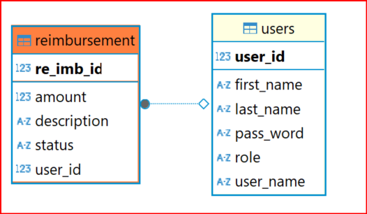

# Executive Summary – Employee Reimbursement System (ERS) 

The goal of project 1 is to create a Java Full Stack Employee Reimbursement System (ERS). The main use case of the ERS centers around Employees submitting Reimbursements that can either be accepted or denied by Managers. The tech stack will consist of a React-Based Front end, communicating via HTTP to a Spring-Based Back end. The database will be either a local or cloud-based Postgres database. The entire application will have error handling in place to prevent the user from invoking unauthorized functionalities or entering invalid inputs. 

##Employee User Stories

Users using the application can:

1. Create an account (create new User – default role should be employee)

2. Create a new Reimbursement

3. See all reimbursement tickets (only their own)

4. See only their pending reimbursement tickets

[Some other functionality of your choice]

OPTIONAL: Update the description of a pending reimbursement 

##Manager User Stories
Managers using the application can:

1. See all reimbursements

2. See all pending reimbursements

3. Resolve a reimbursement (update status from PENDING to APPROVED or DENIED)

4. See all Users

5. Delete a User (should also delete any related reimbursements)

6. OPTIONAL: Update an employee’s role to manager

*Managers can do anything Users can do. No need for role checks on User functionalities. 

##Users who are not logged in to the application can ONLY:  

1. Attempt to log in.

2. Register for a new account (create new User)

Users should not be able to access the other user stories before logging in.

##Database Architecture

